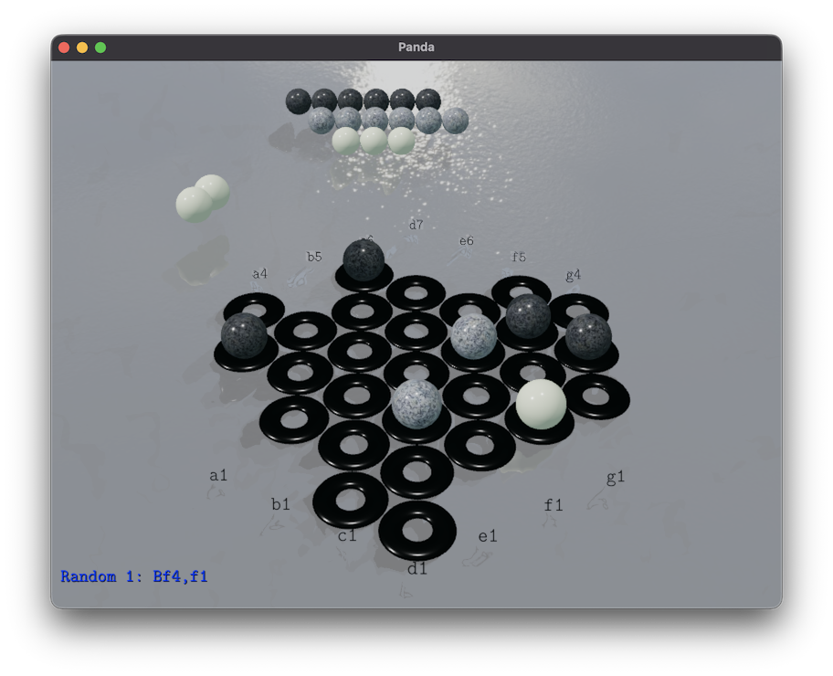
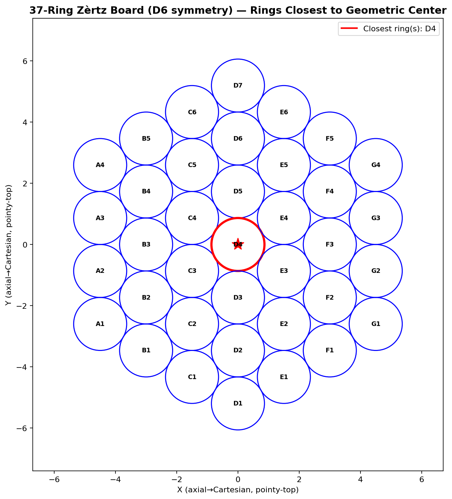
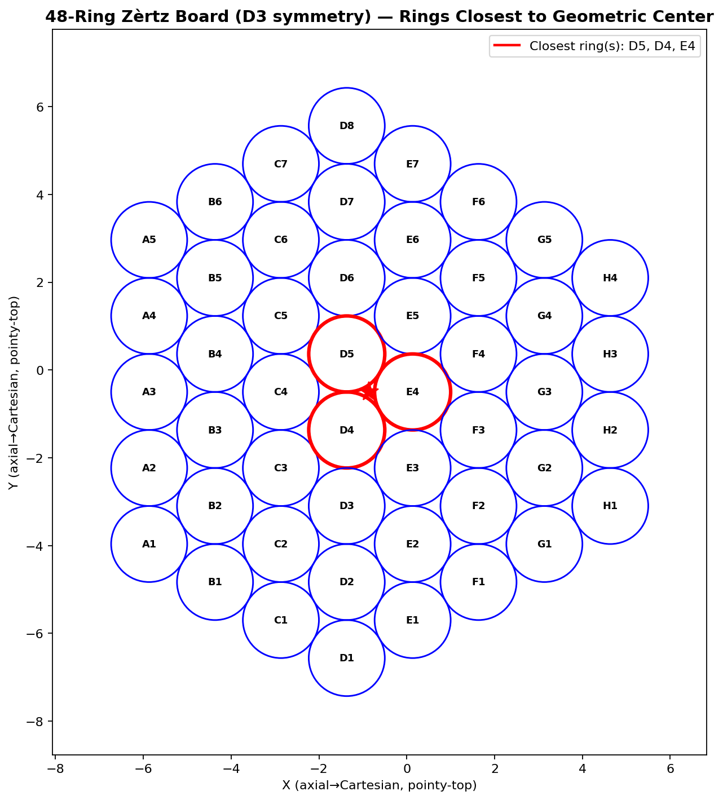
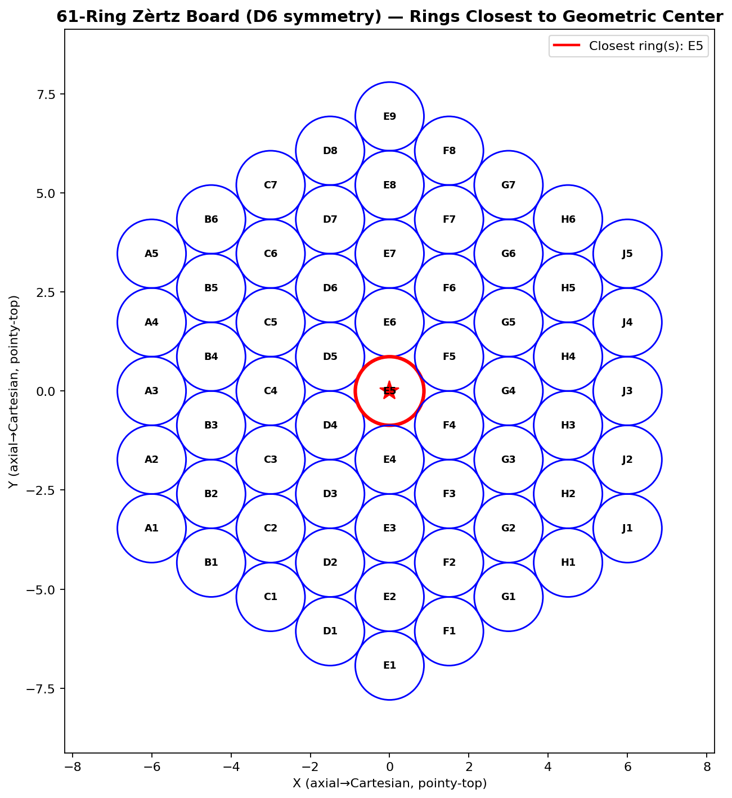

# Zèrtz 3D

3D implementation of the abstract board game Zèrtz with a Panda3D renderer and a Rust-accelerated Monte Carlo Tree Search engine.



- [Zèrtz rules](data/docs/reference/zertz_rules.md)
- [Game State representation](data/docs/reference/game_state_representation.md)
- [Canonicalisation](data/docs/reference/canonicalization.md)
- [Visualization tools reference](data/docs/reference/visualization_tools.md)

[](https://www.python.org/downloads/)
[](LICENSE)

## Overview
**THIS IS A WORK-IN-PROGRESS!**

Zèrtz 3D pairs Python controllers with a PyO3 Rust extension that holds the core rule engine and search. The project targets reproducible AI experimentation, human play through Panda3D, and offline analysis of tuning runs.

## Key Features

### Gameplay
- 37, 48, and 61 ring boards with Standard and Blitz marble pools
- Deterministic runs via seedable RNG and transcript logging
- Replay support for internal transcripts, official notation, and Boardspace SGF files

### AI & Search
- Monte Carlo Tree Search with RAVE, progressive widening, FPU, and optional time limits
- Multi-threaded search with virtual loss and transposition tables
- Shared Python/Rust interfaces for swapping in new heuristics or training loops

### Visualisation
- Panda3D renderer with highlight modes, coordinate overlays, and water/lighting effects
- Headless execution for tournaments or profiling runs
- Text renderer for terminal-based inspection

[//]: # (### Analysis Tooling)

[//]: # (- `scripts/analysis/visualize_tuning_results.py` for Pareto fronts, heatmaps, and 3D summaries)

[//]: # (- `scripts/analysis/profile_mcts_features.py` for measuring iterations per second with different feature flags)

[//]: # (- Structured logs in `data/tuning/` for comparing random and grid searches)

## Installation

### Prerequisites
- Python 3.12+
- Rust toolchain with Cargo
- [`uv`](https://github.com/astral-sh/uv) for environment management

### Setup

```bash
uv sync
./rust-dev.sh        # fast debug build
# ./rust-build.sh    # release build once you need the optimised wheel
```

The game runs without the Rust wheel, but search performance drops noticeably.

## Running Matches

```bash
uv run main.py                                   # Random vs Random
uv run main.py --player1 mcts:iterations=5000 \
               --player2 mcts:iterations=5000 \
               --headless --games 100 --stats    # Tournament batch
uv run main.py --replay data/sgf/sample.sgf      # Replay an SGF log
```

Use `uv run main.py --help` to see the complete set of switches.

## Player Parameters

Players are configured via `--player1 TYPE[:PARAM=VALUE,...]` (same for `--player2`). `TYPE` is `random`, `human`, or `mcts`. Supported MCTS parameters:

| Key | Meaning | Default |
| --- | --- | --- |
| `iterations` | Iterations per move | 1000 |
| `exploration` | UCB1 exploration constant | 1.41 |
| `fpu` | First Play Urgency reduction | `None` |
| `widening` | Progressive widening constant | `None` |
| `rave` | RAVE constant (≈300–3000) | `None` |
| `parallel` | Enable parallel search | `false` |
| `workers` | Worker threads when `parallel` is true | 16 |
| `time_limit` | Seconds per move (stops earlier than `iterations`) | `None` |
| `seed` | RNG seed for deterministic behaviour | `None` |
| `verbose` | Print search statistics each turn | `false` |
| `transposition` / `lookups` / `clear` | Toggle table usage and flushing | `true` |

Example: `--player1 mcts:iterations=8000,rave=900,widening=12,parallel=1,workers=8`.

## Helpful Flags

**Board and flow**

- `--rings {37|48|61}` selects the lattice size
- `--blitz` uses the Blitz marble counts (37-ring only)
- `--games N` runs multiple games back-to-back
- `--seed VALUE` seeds the global RNG
- `--move-duration SECONDS` controls animation pacing
- `--stats` prints aggregate win/loss and timing data

**Logging and replay**

- `--transcript-file [DIR]` writes dictionary logs (defaults to current directory)
- `--notation-file [DIR]` writes official Zèrtz notation
- `--replay PATH` replays a transcript, notation file, or Boardspace SGF
- `--partial` continues with AI play after the replayed sequence

**Renderer**

- `--headless` skips Panda3D for automation
- `--highlight-choices {uniform|heatmap}` visualises legal moves or search preference
- `--show-coords` renders axial coordinates on the board

## Replay and SGF Support

`game/loaders/sgf_loader.py` reads the Boardspace.net variant of Smart Game Format. Player names, timestamps, and board sizes are preserved. Logs generated by Zèrtz 3D can be exported in transcript form or official notation for further analysis.

## Analysis Workflow

Tuning outputs land under `data/tuning/` and can be inspected with `scripts/analysis/visualize_tuning_results.py`. Pareto plots (`pareto_scatter_dark.png`) and heatmaps (`heatmap_dark_*.png`) highlight the trade-offs between win rate, time per move, and the exploration/RAVE/FPU parameters. The profiling script in `scripts/analysis/profile_mcts_features.py` captures iterations per second while toggling search features such as RAVE, first-play urgency, and transposition tables.

## Project Layout

```
main.py                  # CLI entry point
controller/              # Match coordination and scheduling
factory/                 # Player/renderer wiring
game/                    # Rule engine, players, loaders, utilities
renderer/                # Panda3D scene graph and text renderer
rust/                    # hiivelabs_zertz_mcts PyO3 extension
scripts/analysis/        # Tuning, profiling, and visualisation scripts
shared/                  # Cross-layer data structures and helpers
data/                    # Reference docs, tuning outputs, SGF samples
tests/                   # Pytest suites and integration checks
```

## Board Layout

- **37 rings**: 7×7 hex grid (standard)



- **48 rings**: 8×8 hex grid



- **61 rings**: 9×9 hex grid (uses ABCDEFGHJ coordinate scheme, skipping 'I')



Coordinate mapping for other board sizes lives alongside the visualisations in `data/docs/visualizations/`.

## Development

### Rust extension
- `./rust-dev.sh` builds an editable debug wheel
- `./rust-build.sh` produces the optimised release build
- `uv run python -c "import hiivelabs_zertz_mcts"` sanity-checks the install

### Tests

```bash
uv run pytest
uv run pytest -m "not slow"         # skip long simulations
./generate_coverage_report.sh       # HTML report under htmlcov/
```

## License

[GNU Affero General Public License v3.0](LICENSE)

## Contributing

Please open issues for bugs or missing documentation. Coordinated pull requests are welcome once the initial release stabilises; urgent fixes can be proposed sooner.
